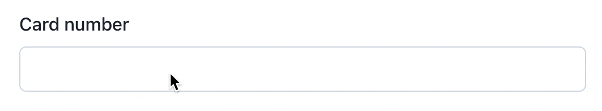
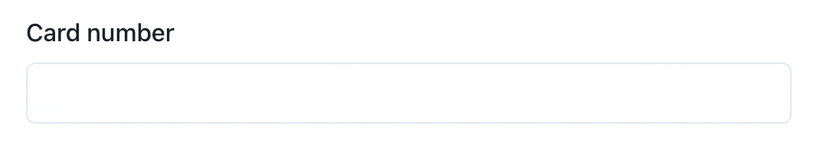

# react-ux-form

[](https://github.com/swan-io/react-ux-form/blob/master/LICENSE)
[](https://www.npmjs.org/package/react-ux-form)
[](https://bundlephobia.com/result?p=react-ux-form)

A simple, blazing fast and opinionated form library for React & React Native.

## Features

- Subscription based field updates (avoid rerendering the whole form on each keystroke 🔥)
- Validation strategies ✨
- Field sanitization
- Mounted-only fields validation
- Sync & async field validation
- Sync & async form submission
- Advanced focus handling
- First-in-class TypeScript support

## Motivation

Why another React form library 🤔?<br>
Because, as silly as it seems, we didn't found any existing library which fits our needs:

- With validation strategies - because we fell in love for them ♥️ ([re-formality](https://github.com/MinimaHQ/re-formality) is unfortunately only available for ReScript)
- **and** which is subscription based (for performances with potential huge forms)
- **and** with simple validation (functions are easily testables and reusables)
- **and** which don't try to validate unmounted fields
- **and** with built-in focus management (to improve the flow of our React Native forms)

## Setup

```bash
$ npm install --save react-ux-form
# --- or ---
$ yarn add react-ux-form
```

## ✨ Validation strategies

The key of **good UX** is simple: validation should be executed **in continue**, user feedback should be provided **when required**.

### Quick example: The credit card field

We would like to display some sort of valid state icon when the input value match a valid credit card number, but don't want to display an error until the user blur the field and let the value in an invalid state.

#### Something like this:




How do we achieve such magic? With the `onFirstSuccessOrFirstBlur` strategy 🧙‍♂️.<br>

```tsx
const { Field } = useForm({
  cardNumber: { initialValue: "", strategy: "onFirstSuccessOrFirstBlur" },
});
```

Of course, `onFirstSuccessOrFirstBlur` will not fit perfectly every use-case!<br>
That's why every field could have its own `strategy`:

| Strategy                    | When feedback will be emitted?                                 |
| --------------------------- | -------------------------------------------------------------- |
| `onFirstChange`             | On first change (as the user types)                            |
| `onFirstSuccess`            | On first validation success                                    |
| `onFirstBlur`               | On first field blur                                            |
| `onFirstSuccessOrFirstBlur` | On first validation success or first field blur. **(default)** |
| `onSubmit`                  | On form submit                                                 |

👉 Note that once the first feedback is given (the field is `valid` or has an `error` message), the field switches to what we call a `talkative` state: feedback will be updated on each value change until field or form is reset.

## API

### useForm()

`useForm` takes one argument (your fields config) and returns a set of helpers (functions, components and values) to manage your form state.

```tsx
const {
  formStatus,
  Field,
  getFieldState,
  setFieldValue,
  focusField,
  resetField,
  validateField,
  resetForm,
  submitForm,
} = useForm({
  fieldName: {
    // Default values
    initialValue: "",
    strategy: "onFirstSuccessOrFirstBlur",
    debounceInterval: 0,
    equalityFn: (value1: string, value2: string) => Object.is(value1, value2),
    sanitize: (value) => value,
    validate: (value) => {},
  },
});
```

TODO

## Quickstart

```tsx
import * as React from "react";
import { useForm } from "react-ux-form";
import validator from "validator";

export const BasicForm = () => {
  const { Field, resetForm, submitForm } = useForm({
    // Define form fields
    emailAddress: {
      strategy: "onFirstSuccessOrFirstBlur",
      initialValue: "",
      sanitize: (value) => value.trim(), // trim value before validation and submit
      validate: (value) => { // validation function
        if (!validator.isEmail(value)) {
          return "A valid email is required";
        }
      },
    },
  });

  const onSubmit = (event: React.FormEvent) => {
    event.preventDefault();

    submitForm(
      (values) => { // called if all fields are valid
        console.log("values", values);
      },
      (errors) => { // called if at least 1 field is invalid
        console.log("errors", errors);
      },
    );
  };

  return (
    <form onSubmit={onSubmit}>
      <Field name="emailAddress">
        {({ error, onBlur, onChange, ref, valid, validating, value }) => (
          <>
            <label>Email address</label>

            <input
              ref={ref}
              value={value}
              onBlur={onBlur}
              onChange={(e) => onChange(e.currentTarget.value)}
            />

            {valid && <span>Valid</span>}
            {validating && <span>Validating...</span>}
            {error && <span>Invalid</span>}
          </>
        )}
      </Field>

      <div>
        <button type="button" onClick={resetForm}>
          Reset
        </button>

        <button type="submit">
          Submit
        </button>
      </div>
    </form>
  );
};
```

# Acknowledgements

- [re-formality](https://github.com/MinimaHQ/re-formality) for the [validation strategies](https://github.com/MinimaHQ/re-formality/blob/master/docs/02-ValidationStrategies.md) idea.
- [react-jeff](https://github.com/jamiebuilds/react-jeff) for its simple and testable validation API.
- [react-hook-form](https://react-hook-form.com/) and [react-final-form](https://github.com/final-form/react-final-form) for their subscription pattern implementations.
